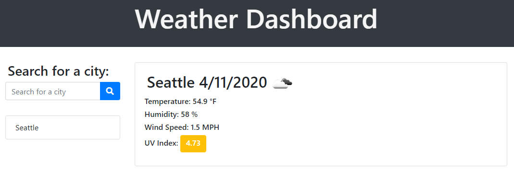
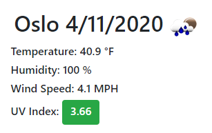
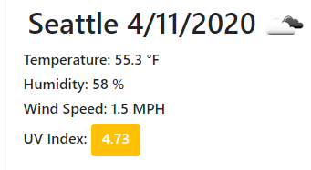
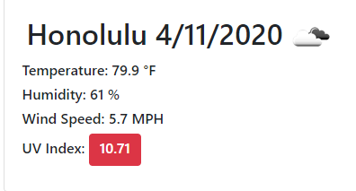
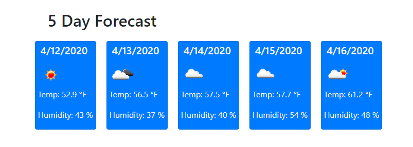
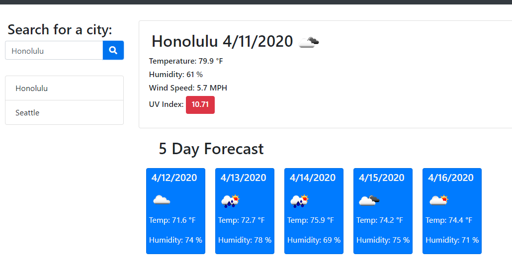

# Weather_Dashboard

I created a simple weather app primarily using jQuery and the Open Weather Map API. 

https://thedanitor.github.io/Weather_Dashboard/

## Technologies used

The site was created to meet design specs using Bootstrap enhanced with my own CSS. 

All weather data is rendered dynamically with jQuery and is obtained using the Open Weather API. 

https://openweathermap.org/api

## Description

When the website is loaded weather data is displayed for the most recently-searched city. If there is no city data in local storage Seattle is chosen as the default. 

Current weather data displayed is the city name, date, temperature, humidity, wind speed, UV index, and an icon with a graphical representation of the day's weather. The UV index number is color coded green, yellow, or red if conditions are considered favorable, moderate, or severe.

Also included is a five day forecast displaying the date, temperature, and humidity along with an icon.

There is a search bar in the top left corner which enables the user to find data for a different city once the search button is clicked. Then that city name is added to a list under the search bar. Once the city is added to the list it can be clicked on to display it's weather data again.

## Acknowledgement

Author Dan Weikart would like to thank everyone in his UW Coding Bootcamp class for helping improve his proficiency of HTML, CSS, JavaScript, and jQuery.

Special shoutout to tutor Namita Shenai, instructor John Young and TA's Abdul Aziz and Ben Vaagen.

